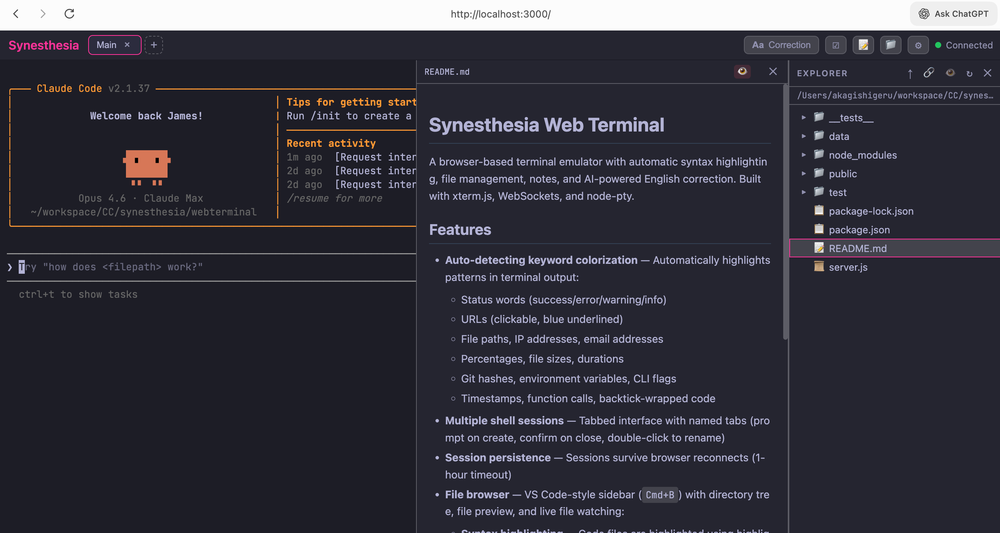

# Synesthesia Web Terminal

A browser-based terminal emulator with automatic syntax highlighting, file management, notes, and AI-powered English correction. Built with xterm.js, WebSockets, and node-pty.



## Features

- **Auto-detecting keyword colorization** — Automatically highlights patterns in terminal output:
  - Status words (success/error/warning/info)
  - URLs (clickable, blue underlined)
  - File paths, IP addresses, email addresses
  - Percentages, file sizes, durations
  - Git hashes, environment variables, CLI flags
  - Timestamps, function calls, backtick-wrapped code
- **Multiple shell sessions** — Tabbed interface with named tabs (prompt on create, confirm on close, double-click to rename)
- **Session persistence** — Sessions survive browser reconnects (1-hour timeout)
- **File browser** — VS Code-style sidebar (`Cmd+B`) with directory tree, file preview, and live file watching:
  - **Syntax highlighting** — Code files are highlighted using highlight.js, colors adapt to the active theme
  - **Markdown preview** — Toggle between raw syntax and rendered markdown view for `.md` files
  - **Image preview** — PNG, JPG, GIF, SVG, WebP, ICO, and BMP files display inline
  - **PDF preview** — PDF files render in an embedded viewer
  - **Folder navigation** — Editable path bar, go-up button, double-click to enter directories
  - **Live updates** — Previewed files auto-refresh when modified on disk
  - **Resizable panel** — Drag the left edge to resize (up to 85% of viewport)
  - **Persistent state** — Toggling the sidebar preserves the open preview and file watcher
- **Todo panel** (`Cmd+J`) — Quick-access checklist with add, toggle, and delete
- **Notes panel** (`Cmd+K`) — Rich note-taking with tile view:
  - Title and multi-line content preview in tile grid
  - Image thumbnails on tiles
  - Editor with left=textarea, right=rendered preview (text + images)
  - Paste images from clipboard or upload files via button
  - Server-side persistence; uploaded images cleaned up on note deletion
- **English correction** — Toggle correction mode (`Cmd+X`) to type in a dedicated panel, review word-level diffs, then accept or edit before sending to the terminal. Two modes configurable in Settings → Grammar:
  - **Grammar**: Fix spelling and grammar errors only
  - **Polish**: Improve expression while preserving meaning
  - **Multi-provider LLM support**: Anthropic (Claude Haiku), Google Gemini, or OpenAI (GPT-4o mini). Configure API keys and select active provider in Settings → LLM.
- **Music player** — Built-in background music player with dedicated side panel:
  - Supports YouTube URLs and direct audio file URLs (mp3, ogg, wav, etc.)
  - Transport controls: play/pause, previous, next with progress bar and seek
  - Playback modes: sequential or random order, repeat off/all/one
  - Drag-and-drop track reordering
  - Add tracks via URL input, click to play, remove individual tracks
- **Tabbed settings panel** — Settings organized into Theme, Grammar, and LLM tabs
- **Theme support** — 27 built-in themes plus full color customization via settings panel:
  - **Dark**: Synesthesia, Dracula, Tokyo Night, Catppuccin, Rosé Pine, Synthwave '84, Cyberpunk, Nord, Gruvbox, Ayu Dark, One Dark, Monokai, Tinacious Design
  - **Soft**: Catppuccin Frappé, Catppuccin Macchiato, Everforest Dark, Palenight, Kanagawa, Rosé Pine Moon, Everforest Light
  - **Light**: GitHub, One Light, Ayu Light, Solarized Light, Catppuccin Latte, Rosé Pine Dawn, Tinacious Design Light
- **Clickable links** — URLs in terminal output open in a new tab
- **Image paste & preview** — Paste images from clipboard into the terminal; displayed as `[Image #N]` markers with hover preview and full-size viewer
- **Terminal recording** — Automatically record Claude Code sessions:
  - Auto-start/stop when Claude process is detected
  - Recordings with no user input are automatically discarded
  - Full-screen xterm.js playback that fills the modal with scrollable content
  - AI-generated summaries (abstract + detail) via active LLM provider
  - Browse all recordings in a dedicated modal with metadata (date, duration, first input)
  - Delete individual recordings
- **Terminal resize** — Automatic terminal resizing to fit the browser window
- **Font settings** — Adjustable font size and line height via settings panel

## Tech Stack

- **Frontend**: React, TypeScript, Vite, Zustand, xterm.js
- **Backend**: Node.js, Express, WebSocket (ws), node-pty
- **Testing**: Vitest
- **AI**: Multi-provider LLM (Anthropic / Gemini / OpenAI) for correction and summaries

## Getting Started

### Prerequisites

- Node.js (v16+)
- npm
- An API key for at least one LLM provider (optional, for English correction and recording summaries):
  - [Anthropic](https://console.anthropic.com/) (Claude Haiku 4.5)
  - [Google Gemini](https://aistudio.google.com/apikey) (Gemini 2.0 Flash)
  - [OpenAI](https://platform.openai.com/api-keys) (GPT-4o mini)

### Install & Run

```bash
npm install
npm start
```

Open `http://localhost:3000` in your browser.

### Run Tests

```bash
npm test
```

## Project Structure

```
├── server.js              # Express + WebSocket server, PTY management, REST API
├── src/
│   ├── main.tsx           # React entry point
│   ├── App.tsx            # Root component
│   ├── types/index.ts     # Shared TypeScript types
│   ├── stores/            # Zustand stores (9 stores + messageRouter)
│   ├── lib/               # Utilities (diff, highlighter, colorUtils, themes, api)
│   ├── hooks/             # Custom hooks (useKeyboardShortcuts)
│   ├── components/        # React components (Header, Terminal, FileBrowser, Modals)
│   ├── terminal/          # Terminal singleton instance
│   └── styles/index.css   # All styles
├── public/
│   └── index.html         # Legacy monolithic SPA (still present)
├── data/                  # Server-side persistent storage (todos, notes, LLM config, recordings)
└── package.json
```

## API Endpoints

| Method | Path | Description |
|--------|------|-------------|
| `GET` | `/api/todos` | Retrieve all todos |
| `PUT` | `/api/todos` | Save todos |
| `GET` | `/api/notes` | Retrieve all notes |
| `PUT` | `/api/notes` | Save notes |
| `DELETE` | `/api/notes/:id` | Delete note and clean up uploaded images |
| `POST` | `/api/upload` | Upload file (base64 JSON) |
| `GET` | `/api/file` | Read file contents (for file browser) |
| `GET` | `/api/recordings` | List all recording metadata |
| `GET` | `/api/recordings/:id` | Get full recording with events |
| `DELETE` | `/api/recordings/:id` | Delete a recording |
| `POST` | `/api/recordings/:id/summary` | Generate AI summary for a recording |
| `GET` | `/api/recordings/:id/summary` | Get saved recording summary |
| `GET` | `/api/llm-config` | Get LLM provider config (keys never exposed) |
| `PUT` | `/api/llm-config` | Update LLM provider keys / active provider |

## Keyboard Shortcuts

| Shortcut | Action |
|----------|--------|
| `Cmd+B` | Toggle file browser sidebar |
| `Cmd+J` | Toggle todo panel |
| `Cmd+K` | Toggle notes panel |
| `Cmd+M` | Toggle music playback |
| `Cmd+H` | Toggle recordings panel |
| `Cmd+X` | Toggle English correction mode |
| `Shift+Enter` | Send newline without executing |
| `Ctrl+Shift+T` | New tab |
| `Ctrl+Shift+W` | Close current tab |
| `Ctrl+Tab` | Next tab |

### In Correction Panel

| Shortcut | Action |
|----------|--------|
| `Enter` | Check & correct text (input) / Accept correction (result) |
| `Shift+Enter` | Newline in text input |
| `Cmd+Enter` | Send text directly without correction |
| `Esc` | Clear text (input) / Go back to edit (result) |
